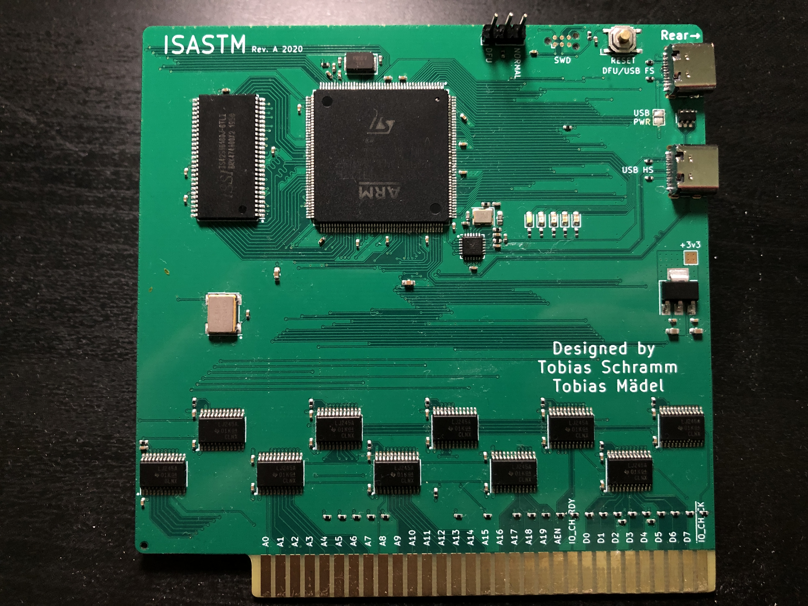

ISASTM
=============================

### Overview

ISASTM is an ISA host using a STM32H743 CPU, 32 MiB SDRAM and USB 2.0 Full-Speed / High-Speed.  
It can enable ISA cards to be used inside a VM or even emulate an x86 PC internally with an external ISA bus. 

The card is designed to be used with an ISA backplane, which supplies power and connects the ISA slots. 

### Errata Rev. A
- Signal integrity issues, level shifters seem to drive the bus too hard. Maybe 33R series resistance.
- Reset line is missing a pull up on the ISA bus/HV side
- USB 2.0 High speed (480 MBit/s) untested, might not work.

### Additional info

[Firmware](https://github.com/Manawyrm/ISASTM-Firmware)  
[Schematic](https://github.com/Manawyrm/ISASTM/blob/master/gerbers/RevA/ISASTM.pdf)  
  
[Twitter: Project thread](https://twitter.com/Manawyrm/status/1302558858360033280)  

### Credits
Thanks to [@Toble_Miner](https://github.com/TobleMiner) for layouting the PCB!